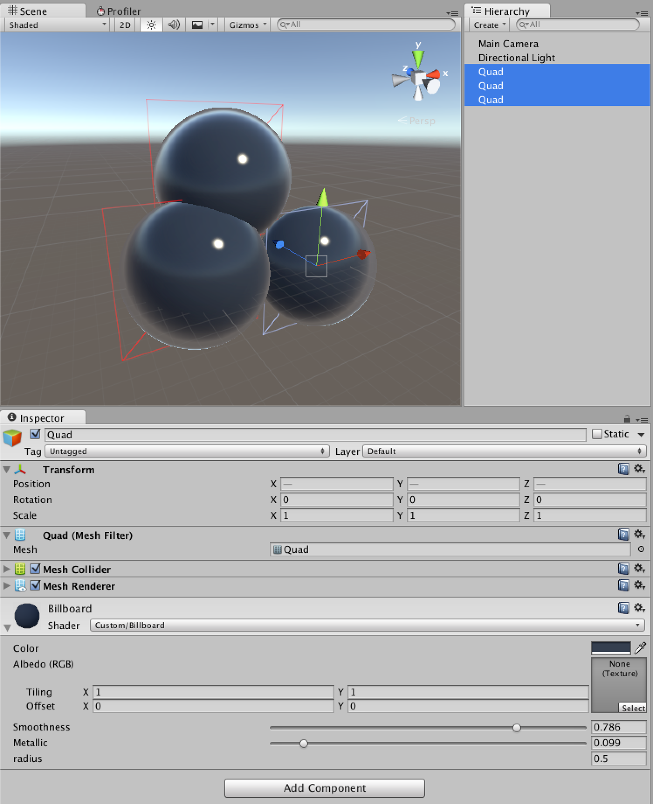

#BillboardStandardLit
BillboardShaderに`outDepth:SV_Depth`で深度情報を付加。  
SurfaceShaderから変換し生成したv2fShaderを元に作成。

このプロジェクトでは、Deferred Passのみ。ForwardRenderingでも同様の事は可能です。

##Movie

[Youtube](https://youtu.be/RPqAUCWYGTw)

##Image

深度情報が書き込まれているので、玉どうしが重なり合う時の境界が自然になる。

##Link

- [v2fStandardLit Shader](https://gist.github.com/sugi-cho/78182930a1c553a4ed70)
- [sugi.cc](http://sugi.cc)